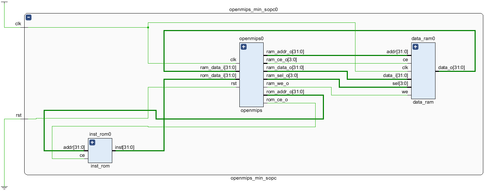
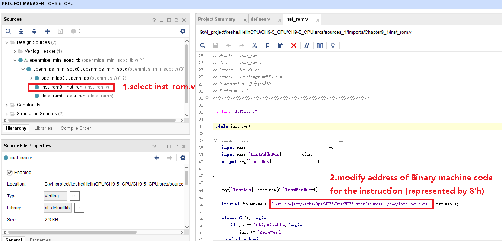

# MIPS32-5pip-CPU 设计实现

## 设计要求

独立设计并实现一个电路模块和一款具有哈佛结构的32位标量处理器，该处理器兼容MIPS32 release 1指令集架构，具有5级静态流水。需要考虑流水线停顿、延迟槽、控制相关、数据相关、结构相关等。

## 内容安排

### 流水线CPU设计

至少实现以下21条指令：ADD、SUB、OR、AND、XOR、NOR、SLT、SLTU、SLL、SRL、SRA、LUI，ADDU、ADDIU、SUBU、LW、SW、BEQ、BNE、JAL、JR。

#### 1. 算术操作指令
- **ADD**：加法，将两个寄存器的值相加。
- **SUB**：减法，从一个寄存器中减去另一个寄存器的值。
- **ADDU**：无符号加法，不考虑溢出。
- **ADDIU**：立即数无符号加法。
- **SUBU**：无符号减法，不考虑溢出。

#### 2. 逻辑与移位指令
- **OR**：按位或。
- **AND**：按位与。
- **XOR**：按位异或。
- **NOR**：按位非或。
- **SLT**：如果第一个寄存器小于第二个，则设置。
- **SLTU**：无符号版本的SLT。
- **SLL**：逻辑左移。
- **SRL**：逻辑右移。
- **SRA**：算术右移。

#### 3. 移动操作指令
- **LUI**：加载上半字，将立即数放入寄存器的高16位。

#### 4. 转移指令
- **BEQ**：如果等于则分支。
- **BNE**：如果不等则分支。
- **JAL**：跳转并链接。
- **JR**：跳转到寄存器的内容所指地址。

#### 5. 加载存储指令
- **LW**：加载字。
- **SW**：存储字。

### 设计要求
1. CPU微结构为静态5级流水。
2. 实现MIPS架构的延迟槽技术，延迟槽可以是任意指令。
3. 控制相关由分支指令造成，通过延迟槽技术可以完美解决。
4. 结构相关即某一级流水停顿了，会阻塞上游的流水级。
5. 要求仿真运行测试程序通过。

## 操作说明
1. Vivado/ModelSim环境。
2. 在《MIPS指令系统规范》找到指令对应的二进制码，并以十六进制形式输入inst_rom.data。
3. 因为我用的vivado，inst_rom.data用了绝对地址，所以，修改成你的地址。

4. 运行模拟。
